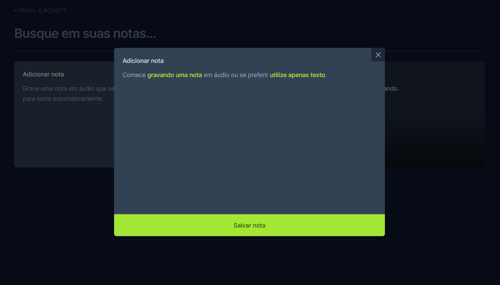

# Bloco de Notas

Este é um projeto de bloco de notas desenvolvido em React, TypeScript e Tailwind CSS. Permite aos usuários adicionar notas, seja através de texto ou gravação de áudio, excluir notas existentes e pesquisar notas por palavras-chave.

## Funcionalidades

- Adicionar notas através de texto ou gravação de áudio.
- Excluir notas existentes.
- Pesquisar notas por palavras-chave.

## Tecnologias Utilizadas

- React
- TypeScript
- Tailwind CSS
- Outras bibliotecas como Radix e Sonner
